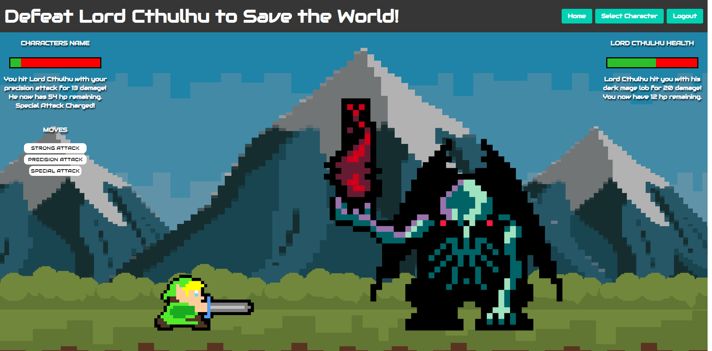

# Cthulhu Invades #

[](https://opensource.org/licenses/MIT)    

## Description ##

Have you ever dreamed of saving the universe from an interdimensional monster? Or maybe you're bored and looking for something to do?  No matter the case, this interactive retro-style video game 
is the perfect way to kill some time.  You get to make your own personal account, choose between several characters with varying stats and proficiencies, and test your steel against the might of Cthulhu.

## Live Website

https://lit-crag-19257.herokuapp.com/

## Table of Contents

  - [Installation](#installation)
  - [Usage](#usage)
  - [Contribution](#Contribution)
  - [Tests](#tests)
  - [Questions](#questions)
  - [Screenshots and Attribution](#Screenshots_and_Attribution)
  - [License](#license)
  
  
  ## Installation

  If cloning locally...
  
  Set up your ```.env file``` and open the ```db``` folder in VSCode's integrated terminal.

  Run ```mysql -u root -p``` this will prompt you to enter your MySQL password. Once your password has been entered run ```SOURCE schema.sql;``` then run ```USE projectTwo_db;``` then run ```exit``` then ```cd ..``` to return to the root level.

  To install all dependencies run ```npm i``` in the terminal.

  ## Usage

  Once dependencies are installed and the database has been populated run ```node server.js``` to start the server.

  ## Contribution

  The contributers for this project are:
  - [Hunter Padgett](https://github.com/HunterPadgett)
  - [Will Summerlin](https://github.com/dubsumm)
  - [Dominic Fisher](https://github.com/DominicFisher18)
  - [Gabriel Fonseca](https://github.com/gabefando)

  ## Tests

  You can test the API routes with Insomnia.

  ## Questions

  If you have any questions you can reach me at gizmokabanjo@gmail.com. 

  Feel free to check out my other projects at [hunterpadgett](https://www.github.com/hunterpadgett).

  ## Screenshots and Attribution

  8-bit characters created with:<br>
  https://make8bitart.com/

  Background Images: <br>
  <a href='https://www.freepik.com/vectors/background'>Background vector created by pikisuperstar - www.freepik.com</a><br>
  <a href='https://www.freepik.com/vectors/pixel-game'>Pixel game vector created by stockgiu - www.freepik.com</a><br>
  <a href='https://www.freepik.com/vectors/arcade-game'>Arcade game vector created by macrovector - www.freepik.com</a><br>

  YouTube Tutorial that gave us inspiration for the fight sequence:<br>
  <a href='https://www.youtube.com/watch?v=sr8bJKSUYwE'>YouTube video by Scott Blenkhorne - https://www.youtube.com/user/primustimus</a>

  
  
  
  
  
  
  

  ## License
      
  This project is licensed under MIT.

  https://opensource.org/licenses/MIT
